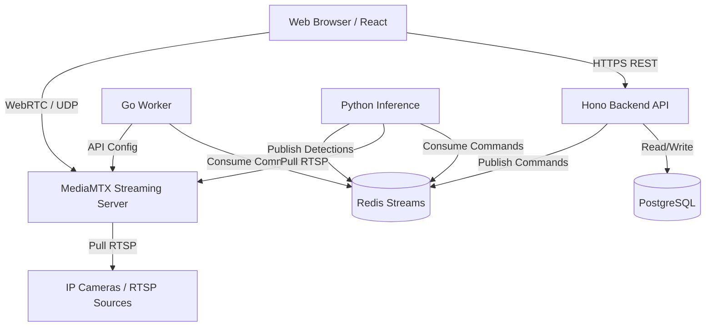
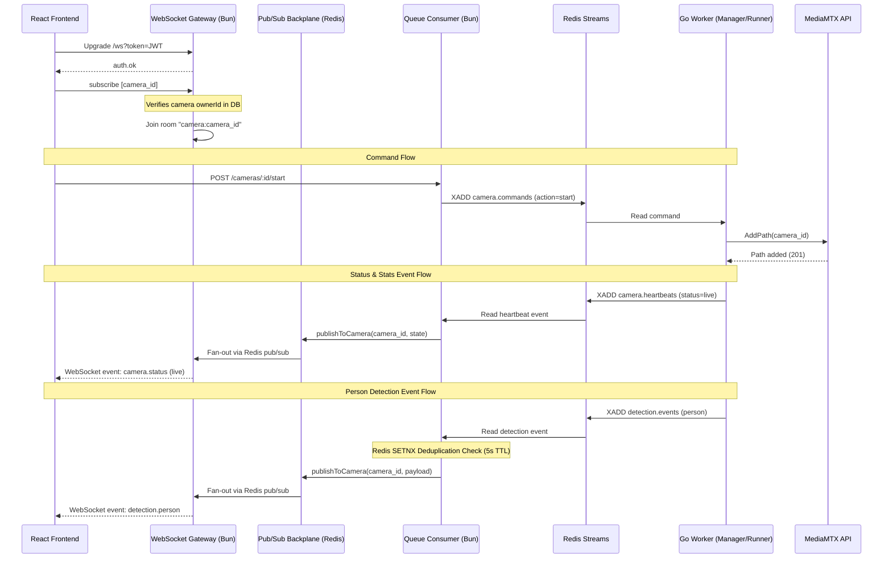
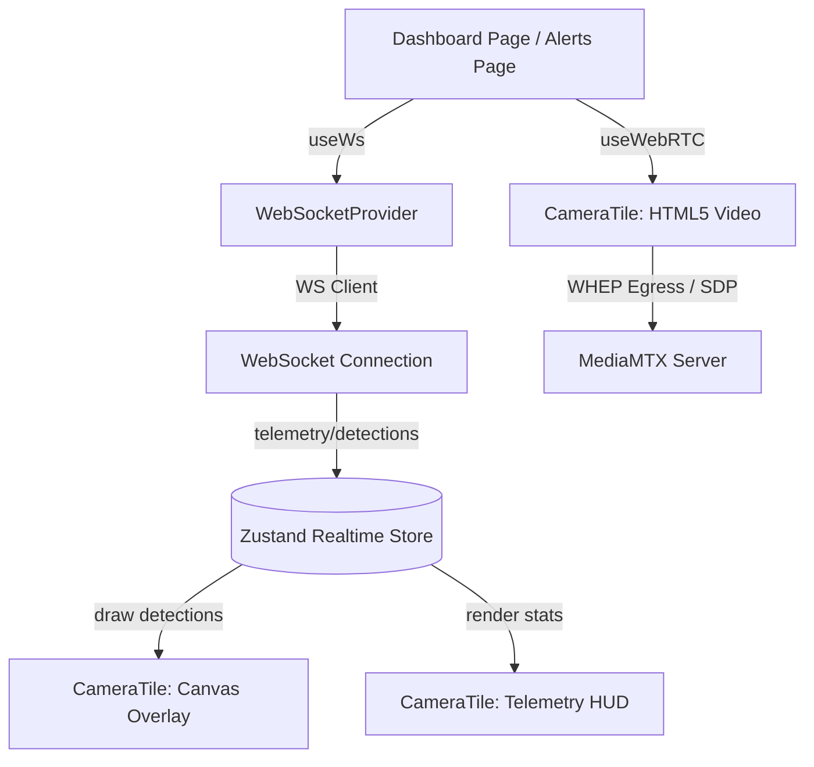

# Enterprise AI Camera Surveillance Platform

A production-oriented, highly scalable surveillance dashboard that streams RTSP camera feeds to the browser using WebRTC, manages camera states reliably using distributed async messaging, and provides a polished, enterprise-grade user interface.

The system is designed with fault isolation, horizontal scalability, and observability in mind. Video streaming, message processing, and application services are completely decoupled.

---

## High-Level Design (HLD)

The architecture is split into four primary planes:
1. **Client Plane (Frontend):** A React SPA providing a premium dashboard for managing and monitoring cameras.
2. **Control Plane (Backend API):** A Hono.js API managing users, auth, metadata, and dispatching stream commands.
3. **Data Plane (Worker & Streaming):** A Go-based worker and MediaMTX stream proxy handling raw RTSP ingestion and WebRTC egress.
4. **Storage Plane:** PostgreSQL for relational metadata, and Redis for distributed asynchronous messaging and session state.



---

## Low-Level Design (LLD)

### Authentication Flow
- Implements a secure **JWT Rotation** strategy.
- Short-lived Access Tokens (15m) are signed via `jose` and stored in memory/HTTP headers.
- Long-lived Refresh Tokens (30d) are cryptographically hashed using SHA-256 and stored in the database.
- Password hashing avoids event-loop blocking by utilizing the highly optimized, native `Bun.password` API (bcrypt) rather than legacy Node libraries like `bcryptjs`.

### Stream Control Lifecycle
1. User clicks "Start Stream" on the UI.
2. Frontend sends a REST request to `POST /api/cameras/:id/start`.
3. Backend updates Postgres `desiredState` to `started`.
4. Backend publishes a `{ command: "start", cameraId, rtspUrl }` message to a **Redis Stream** (`camera_commands`).
5. The **Go Worker**, acting as a consumer group reader, pulls the message.
6. The Worker translates the command into a REST call to the **MediaMTX API**, dynamically adding a new RTSP path proxy.
7. MediaMTX connects to the physical camera.
8. The Frontend connects to MediaMTX via WebRTC to view the feed with sub-second latency.

---

## Trade-offs & Technology Choices

### 1. Monorepo (Turborepo + Bun) vs Polyrepo
**Choice:** Turborepo + Bun  
**Why:** Allows sharing the Database schema (Drizzle ORM) and type definitions flawlessly between the frontend, backend, and scripts. Bun is chosen over Node.js because it natively supports TypeScript, runs significantly faster, and solves critical crypto/hashing event-loop blocking issues natively.  
**Trade-off:** Steeper learning curve for developers unfamiliar with monorepo tooling and workspace symlinking.

### 2. Backend API (Hono) vs Express/NestJS
**Choice:** Hono + Zod + OpenAPI  
**Why:** Hono is lightweight, edge-ready, and incredibly fast on Bun. Pairing it with `@hono/zod-openapi` provides strict runtime validation while automatically generating Swagger documentation.  
**Trade-off:** Smaller middleware ecosystem compared to Express.

### 3. Stream Proxy (MediaMTX) vs Custom Node WebRTC
**Choice:** MediaMTX (Zero-dependency C/Go binary)  
**Why:** Transcoding RTSP (H.264) to WebRTC requires heavy CPU and complex signaling. MediaMTX handles this flawlessly out of the box with near-zero latency.  
**Trade-off:** Less customizable than writing a bespoke SFU (Selective Forwarding Unit) from scratch using `pion/webrtc` or `mediasoup`.

### 4. Asynchronous Messaging (Redis Streams) vs Pub/Sub
**Choice:** Redis Streams  
**Why:** Standard Redis Pub/Sub is "fire-and-forget". If the Go worker crashes, it loses commands. Redis Streams provide **persistence** and **Consumer Groups** with explicit ACK tracking, ensuring 100% reliable command execution even during worker rollouts/crashes.  
**Trade-off:** Slightly higher memory footprint in Redis compared to ephemeral Pub/Sub.

### 5. Worker Language (Go) vs Node.js
**Choice:** Go (Golang)  
**Why:** Stream processing, raw socket handling, and high-concurrency tasks are where Node.js struggles due to its single-threaded event loop. Go's Goroutines allow us to scale the worker to handle thousands of concurrent camera connections effortlessly.

---

## Assumptions & Alternatives

- **Assumption:** Cameras output standard H.264/H.265 streams over RTSP. If cameras use proprietary protocols, custom FFmpeg translation layers would be required.
- **Assumption:** The network allows WebRTC UDP hole punching. If deployed in highly restricted enterprise firewalls, a TURN server (like Coturn) must be deployed alongside MediaMTX.
- **Alternative:** Instead of Redis Streams, **RabbitMQ** could be used. RabbitMQ offers better complex routing topologies, but Redis was chosen to minimize infrastructure footprint since Redis is already used for session/token management.

---

## Scaling to Massive Loads (10,000+ Cameras)

If this system needs to scale to tens of thousands of concurrent cameras and viewers, the current architecture provides a solid foundation but would require the following evolutions:

### 1. Message Broker Upgrade (Kafka)
At massive scale, Redis Streams might consume too much memory or hit bandwidth limits. We would migrate the control plane to **Apache Kafka**, allowing massive distributed event streaming, partitioning by camera region, and permanent event sourcing.

### 2. Geographically Distributed Streaming (SFU Clustering)
A single MediaMTX instance will eventually hit network interface limits (bandwidth/NIC saturation). 
**Solution:** Deploy a distributed WebRTC SFU (Selective Forwarding Unit) cluster using **LiveKit** or **Mediasoup**, deployed across multiple edge regions (AWS Local Zones / Cloudflare). The Go worker would dynamically assign cameras to the geographically closest edge node to the end viewer.

### 3. Worker Horizontal Scaling (K8s HPA)
The Go Worker would be deployed on Kubernetes. We would implement a Horizontal Pod Autoscaler (HPA) that scales the number of Go Worker pods dynamically based on the Kafka topic lag or CPU utilization.

### 4. Distributed Database
The single PostgreSQL instance would become a bottleneck for metadata and event logging.
**Solution:** Migrate to **Aurora PostgreSQL** or a distributed SQL database like **CockroachDB**, utilizing read-replicas for the UI and dedicating the primary node purely for state mutations.

### 5. Cold Storage & Archival
Currently, feeds are assumed to be live. For DVR/NVR capabilities at scale:
**Solution:** The Go worker would pipe RTSP feeds into FFmpeg, chunk the video into 2-second HLS `.ts` segments, and stream them directly into **AWS S3 / MinIO**. The frontend would then use a CDN (CloudFront) to fetch and play back historical footage seamlessly without touching the backend servers.

---

## Local Development Setup

To run the full stack locally:

1. **Start the Infrastructure**
   ```bash
   # Starts Postgres, Redis, MediaMTX, and the mock FFmpeg camera
   docker-compose -f docker-compose.dev.yml up -d
   ```

2. **Run the Database Migrations**
   ```bash
   cd packages/database
   bun run db:push
   ```

3. **Start the Backend API**
   ```bash
   cd apps/backend
   bun dev
   ```

4. **Start the Go Worker**
   By default, the worker runs in **real mode** where person detection is delegated to the YOLO inference service:
   ```bash
   cd apps/worker
   go run main.go
   ```
   If you want to run the worker in **simulation mode** (where the worker itself generates randomized mock detection events without needing the python inference service):
   ```bash
   cd apps/worker
   # Windows:
   $env:SIMULATE_DETECTION="true"; go run main.go
   # Linux/macOS:
   SIMULATE_DETECTION=true go run main.go
   ```

5. **Start the YOLO Inference Service** (Only if running in real mode)
   Make sure you have python 3.9+ and dependencies installed, then run:
   ```bash
   cd apps/inference
   pip install -r requirements.txt
   python main.py
   ```

6. **Start the Frontend Dashboard**
   ```bash
   cd apps/frontend
   bun dev
   ```

---

## Real-time Surveillance Backend & Worker Pipeline (Engineering Doc)

We have implemented a production-grade, secure, and event-driven real-time infrastructure connecting the Hono backend, Redis message streams, and the Go-based ingestion worker.

### 1. Architecture & Real-time Data Flow



#### Core Components
- **Bun-Native WebSocket Gateway (`src/realtime/ws.gateway.ts`)**: Handles client connections, processes JWT authentication, validates camera ownership upon subscription request, throttles subscription counts (max 50 per connection), and automatically terminates dead or unauthenticated sockets via a ping/pong interval loop.
- **Redis Pub/Sub Backplane (`src/realtime/pubsub.ts`)**: Ensures horizontal scalability. When a backend replica receives an event, it publishes it to a Redis pattern channel (`ws:camera:<id>`). Every other running replica listens and broadcasts it to its local WebSocket clients.
- **Background Queue Consumer (`src/queue/consumer.ts`)**: A persistent listener running inside the Bun app process. It reads from Redis Stream Consumer Groups to reliably process heartbeats and detections, update camera stats/state tables in PostgreSQL, and push updates down the pub/sub pipeline.
- **Worker Supervisor & Runners (`apps/worker/internal/camera/`)**:
  - `Manager`: A thread-safe, mutex-guarded manager that acts as the camera supervisor, starting/stopping isolated threads.
  - `Runner`: An interface that allows running camera streams in either **Real mode** (delegating detection to the Python YOLO inference service) or **Simulation mode** (where the worker simulates detection events locally).
  - `RealRunner` (`runner_real.go`): The production runner that registers RTSP ingestion paths in MediaMTX and publishes periodic telemetry stats. It has no simulation logic.
  - `SimulatedRunner` (`runner_simulation.go`): A runner that replicates full end-to-end functionality by generating randomized mock person detections locally.

---

### 2. Assumptions Taken

- **Co-located Redis Backplane**: We assume that both the backend replication nodes and the Go workers share access to a single, high-performance Redis cluster.
- **Direct MediaMTX REST Access**: The worker expects direct HTTP access to the MediaMTX admin control port (`http://mediamtx:9997`) to register path proxies.
- **Stateless Subscriptions**: We assume client UI state is ephemeral. If a socket disconnects, the client must re-issue `subscribe` payloads with its target camera IDs once re-established.
- **Dual Ingestion Runners**: The worker supports both `RealRunner` (YOLO delegated) and `SimulatedRunner` (local mock) modes, toggled via the `SIMULATE_DETECTION` environment variable. By default, it runs in Real mode.
- **Deduplication Window**: A 5-second deduplication TTL on Redis key hashes (`dedupe:<cameraId>:<eventType>:<bucket>`) is assumed sufficient to collapse redundant overlapping detections without delaying distinct security events.

---

### 3. Difficulties Faced & Resolutions

#### A. Action Naming Mismatch
- **Difficulty**: The PostgreSQL database schema models camera states using past tense adjectives (`started`, `stopped`), whereas the worker commands mapped to imperative verbs (`start`, `stop`).
- **Resolution**: Implemented a normalization layer in the backend's `setCameraDesiredState()` service mapping `started` desired states to `start` command actions, keeping the queue command payload clean and aligned with the worker command processor.

#### B. Redis ioredis Subscription Block
- **Difficulty**: When a Redis client joins subscription mode (`psubscribe`), it blocks the socket, preventing any normal command executions (`XADD`, `SET`, etc.) on the same connection.
- **Resolution**: Refactored the Redis module in the backend to lazily instantiate a separate connection replica (`redis.duplicate()`) dedicated exclusively to pub/sub listening.

#### C. Stripping of WebSocket Auth Headers
- **Difficulty**: Modern load balancers, reverse proxies, and CDN networks frequently strip custom headers (like `Authorization`) from initial WebSocket HTTP upgrade handshakes.
- **Resolution**: Designed and implemented a **Dual-Mode Authentication** protocol. The WS gateway attempts query-parameter extraction (`ws://.../ws?token=<JWT>`) on HTTP upgrade. If absent, it opens an unauthenticated channel, allowing the client 5 seconds to submit an `{ "type": "auth", "token": "..." }` frame before forcibly terminating the socket.

#### D. Concurrency Races in Go Worker
- **Difficulty**: Rapid clicks on the frontend UI could dispatch overlapping `start` and `stop` commands for the same camera, causing race conditions inside MediaMTX configuration paths.
- **Resolution**: Implemented a thread-safe `Manager` in the Go worker with a sync Mutex. If a start command arrives for an already running camera, the manager terminates the existing `Runner` gracefully, waits for MediaMTX cleanup, and then initializes the new stream.

#### E. MediaMTX AddPath EOF Errors
- **Difficulty**: The Go worker encountered `EOF` errors when attempting to register paths via the MediaMTX REST API (`POST /v3/config/paths/add/...`).
- **Resolution**: By default, MediaMTX disables its REST API. This was resolved by explicitly setting the `MTX_API: "yes"` environment variable in the docker-compose configuration, enabling the listener on port 9997.

#### F. Redis I/O Timeouts and High CPU Usage
- **Difficulty**: The Go worker experienced rapid `i/o timeout` errors on the Redis connection, accompanied by high CPU usage during stream polling.
- **Resolution**: Identified two root causes:
  1. The `Block` duration in `goredis.XReadGroupArgs` was accidentally set to a raw integer `2`, which Go interprets as 2 nanoseconds, turning the blocking read into a tight polling loop. This was fixed by correctly using `2 * time.Second`.
  2. The underlying TCP socket `ReadTimeout` for the `go-redis` client defaults to 3 seconds, which is too aggressive for blocking stream reads. This was resolved by explicitly setting `ReadTimeout` and `WriteTimeout` to 30 seconds on the client options.

---

### 4. Real-time Frontend Architecture

We have completed the frontend streaming and telemetry pipeline. The UI is dynamic, responsive, and manages high-frequency message streams efficiently.



#### Key Implementation Details
1. **Separated State Architecture**: High-frequency real-time updates (FPS, queue lag, object detection boxes) are stored in a lightweight **Zustand Real-time Store** (`store/realtimeStore.ts`). This avoids triggering heavy TanStack Query cache invalidation refetches, ensuring 60fps UI performance even under dense alert loads.
2. **Dynamic Canvas Bounding-Box Overlay**: Inside `<CameraTile>`, an absolute `<canvas>` element overlays the `<video>` player. Coordinates are mapped to current video element viewport bounds using:
   $$\text{scale}_{x} = \frac{\text{canvas.width}}{\text{video.videoWidth}} \quad \text{and} \quad \text{scale}_{y} = \frac{\text{canvas.height}}{\text{video.videoHeight}}$$
   This makes drawing perfectly responsive across device screens and responsive layouts. Detections are drawn with a neon green glow effect and an auto-clear timeout of 1.5 seconds.
3. **WebRTC-HTTP Egress Protocol (WHEP)**: Live streaming utilizes standard WHEP via `useWebRTC.ts`. Rather than using custom signaling code, the client sends an SDP Offer via an HTTP POST request to `/cameraId/whep` and applies the answer, establishing direct peer-to-peer audio/video transmission with sub-second latency.
4. **Resilient WebSockets with Auto-Recovery**: The `useWebSocket` hook authenticates via a secure query parameter, implements exponential backoff reconnection logic (1s to 30s max), monitors socket health via client-side pings, and automatically restores camera room subscriptions upon successful reconnects.
5. **Dual-Mode Alert Feeds**: The `<AlertFeed>` features a "Live" mode (listening to real-time events via the Zustand store) and a "History" mode (utilizing infinite scroll and cursor pagination via TanStack Query), letting operators view live alerts and filter past detections in a single sidebar panel.

